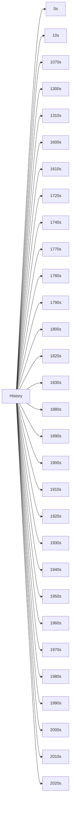

# Master Timeline

- [Open 0s](output/0s.mmd)
- [Open 10s](output/10s.mmd)
- [Open 1070s](output/1070s.mmd)
- [Open 1300s](output/1300s.mmd)
- [Open 1310s](output/1310s.mmd)
- [Open 1600s](output/1600s.mmd)
- [Open 1610s](output/1610s.mmd)
- [Open 1720s](output/1720s.mmd)
- [Open 1740s](output/1740s.mmd)
- [Open 1770s](output/1770s.mmd)
- [Open 1780s](output/1780s.mmd)
- [Open 1790s](output/1790s.mmd)
- [Open 1800s](output/1800s.mmd)
- [Open 1820s](output/1820s.mmd)
- [Open 1830s](output/1830s.mmd)
- [Open 1880s](output/1880s.mmd)
- [Open 1890s](output/1890s.mmd)
- [Open 1900s](output/1900s.mmd)
- [Open 1910s](output/1910s.mmd)
- [Open 1920s](output/1920s.mmd)
- [Open 1930s](output/1930s.mmd)
- [Open 1940s](output/1940s.mmd)
- [Open 1950s](output/1950s.mmd)
- [Open 1960s](output/1960s.mmd)
- [Open 1970s](output/1970s.mmd)
- [Open 1980s](output/1980s.mmd)
- [Open 1990s](output/1990s.mmd)
- [Open 2000s](output/2000s.mmd)
- [Open 2010s](output/2010s.mmd)
- [Open 2020s](output/2020s.mmd)