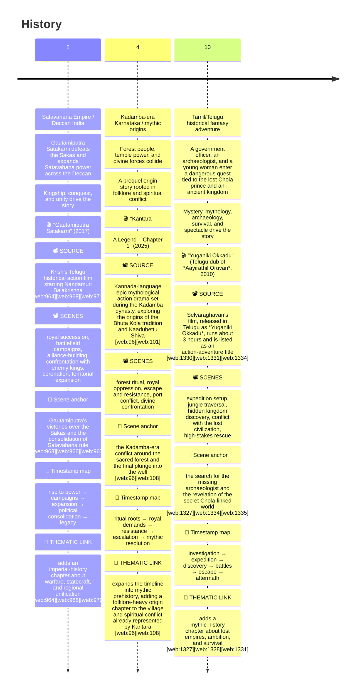

```mermaid
timeline
    title History
    2 : Satavahana Empire / Deccan India
         : Gautamiputra Satakarni defeats the Sakas and expands Satavahana power across the Deccan
         : Kingship, conquest, and unity drive the story
         : 🎬 "Gautamiputra Satakarni" (2017)
         : 📽️ SOURCE: Krish’s Telugu historical action film starring Nandamuri Balakrishna [web:964][web:968][web:971]
         : 📽️ SCENES: royal succession, battlefield campaigns, alliance-building, confrontation with enemy kings, coronation, territorial expansion
         : 📍 Scene anchor: Gautamiputra’s victories over the Sakas and the consolidation of Satavahana rule [web:963][web:966][web:967]
         : 🎯 Timestamp map: rise to power → campaigns → expansion → political consolidation → legacy
         : 🧠 THEMATIC LINK: adds an imperial-history chapter about warfare, statecraft, and regional unification [web:964][web:968][web:970]


     4 : Kadamba-era Karnataka / mythic origins
         : Forest people, temple power, and divine forces collide
         : A prequel origin story rooted in folklore and spiritual conflict
         : 🎬 "Kantara: A Legend – Chapter 1" (2025)
         : 📽️ SOURCE: Kannada-language epic mythological action drama set during the Kadamba dynasty, exploring the origins of the Bhuta Kola tradition and Kaadubettu Shiva [web:96][web:101]
         : 📽️ SCENES: forest ritual, royal oppression, escape and resistance, port conflict, divine confrontation
         : 📍 Scene anchor: the Kadamba-era conflict around the sacred forest and the final plunge into the well [web:96][web:108]
         : 🎯 Timestamp map: ritual roots → royal demands → resistance → escalation → mythic resolution
         : 🧠 THEMATIC LINK: expands the timeline into mythic prehistory, adding a folklore-heavy origin chapter to the village and spiritual conflict already represented by Kantara [web:96][web:108]


    10 : Tamil/Telugu historical fantasy adventure
         : A government officer, an archaeologist, and a young woman enter a dangerous quest tied to the lost Chola prince and an ancient kingdom
         : Mystery, mythology, archaeology, survival, and spectacle drive the story
         : 🎬 "Yuganiki Okkadu" (Telugu dub of *Aayirathil Oruvan*, 2010)
         : 📽️ SOURCE: Selvaraghavan’s film, released in Telugu as *Yuganiki Okkadu*, runs about 3 hours and is listed as an action-adventure title [web:1330][web:1331][web:1334]
         : 📽️ SCENES: expedition setup, jungle traversal, hidden kingdom discovery, conflict with the lost civilization, high-stakes rescue
         : 📍 Scene anchor: the search for the missing archaeologist and the revelation of the secret Chola-linked world [web:1327][web:1334][web:1335]
         : 🎯 Timestamp map: investigation → expedition → discovery → battles → escape → aftermath
         : 🧠 THEMATIC LINK: adds a mythic-history chapter about lost empires, ambition, and survival [web:1327][web:1328][web:1331]
```