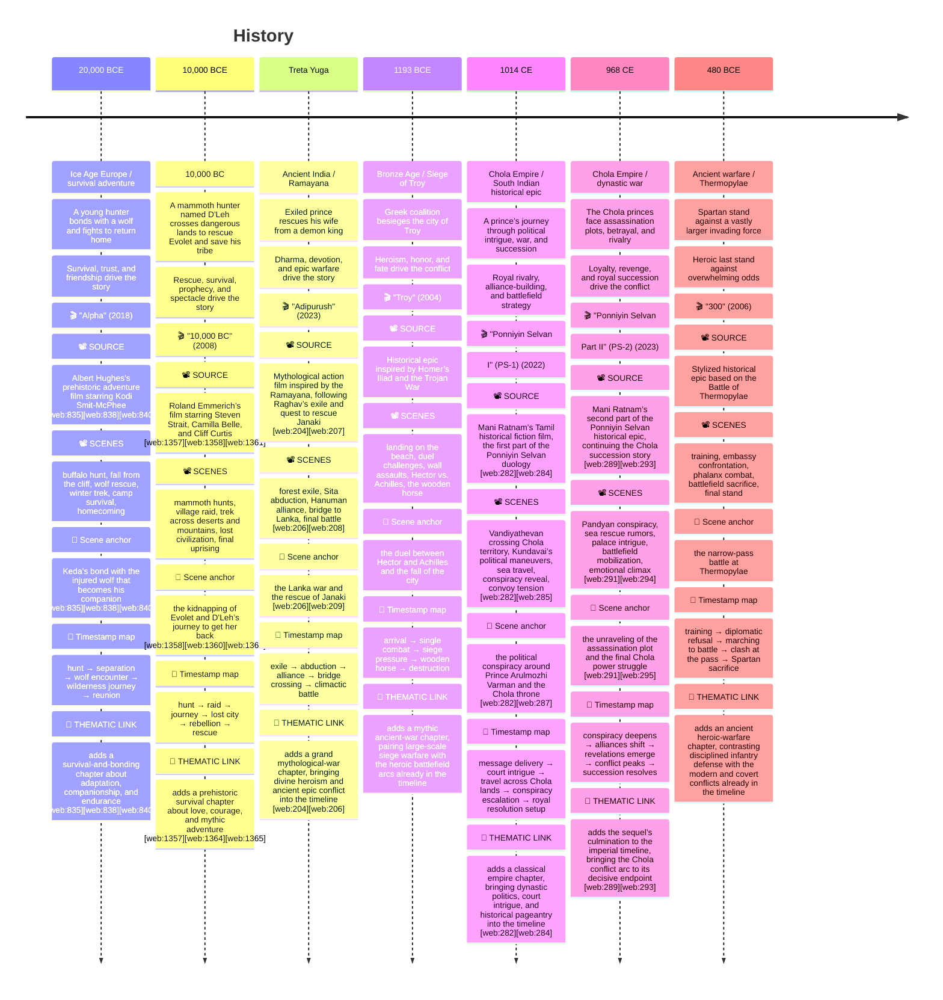

```mermaid
timeline
    title History
    20,000 BCE : Ice Age Europe / survival adventure
         : A young hunter bonds with a wolf and fights to return home
         : Survival, trust, and friendship drive the story
         : 🎬 "Alpha" (2018)
         : 📽️ SOURCE: Albert Hughes’s prehistoric adventure film starring Kodi Smit-McPhee [web:835][web:838][web:840]
         : 📽️ SCENES: buffalo hunt, fall from the cliff, wolf rescue, winter trek, camp survival, homecoming
         : 📍 Scene anchor: Keda’s bond with the injured wolf that becomes his companion [web:835][web:838][web:840]
         : 🎯 Timestamp map: hunt → separation → wolf encounter → wilderness journey → reunion
         : 🧠 THEMATIC LINK: adds a survival-and-bonding chapter about adaptation, companionship, and endurance [web:835][web:838][web:840]


    10,000 BCE: 10,000 BC
        : A mammoth hunter named D'Leh crosses dangerous lands to rescue Evolet and save his tribe
         : Rescue, survival, prophecy, and spectacle drive the story
         : 🎬 "10,000 BC" (2008)
         : 📽️ SOURCE: Roland Emmerich’s film starring Steven Strait, Camilla Belle, and Cliff Curtis [web:1357][web:1358][web:1361]
         : 📽️ SCENES: mammoth hunts, village raid, trek across deserts and mountains, lost civilization, final uprising
         : 📍 Scene anchor: the kidnapping of Evolet and D'Leh’s journey to get her back [web:1358][web:1360][web:1362]
         : 🎯 Timestamp map: hunt → raid → journey → lost city → rebellion → rescue
         : 🧠 THEMATIC LINK: adds a prehistoric survival chapter about love, courage, and mythic adventure [web:1357][web:1364][web:1365]


     Treta Yuga : Ancient India / Ramayana
         : Exiled prince rescues his wife from a demon king
         : Dharma, devotion, and epic warfare drive the story
         : 🎬 "Adipurush" (2023)
         : 📽️ SOURCE: Mythological action film inspired by the Ramayana, following Raghav’s exile and quest to rescue Janaki [web:204][web:207]
         : 📽️ SCENES: forest exile, Sita abduction, Hanuman alliance, bridge to Lanka, final battle [web:206][web:208]
         : 📍 Scene anchor: the Lanka war and the rescue of Janaki [web:206][web:209]
         : 🎯 Timestamp map: exile → abduction → alliance → bridge crossing → climactic battle
         : 🧠 THEMATIC LINK: adds a grand mythological-war chapter, bringing divine heroism and ancient epic conflict into the timeline [web:204][web:206]

     1193 BCE : Bronze Age / Siege of Troy
         : Greek coalition besieges the city of Troy
         : Heroism, honor, and fate drive the conflict
         : 🎬 "Troy" (2004)
         : 📽️ SOURCE: Historical epic inspired by Homer’s Iliad and the Trojan War
         : 📽️ SCENES: landing on the beach, duel challenges, wall assaults, Hector vs. Achilles, the wooden horse
         : 📍 Scene anchor: the duel between Hector and Achilles and the fall of the city
         : 🎯 Timestamp map: arrival → single combat → siege pressure → wooden horse → destruction
         : 🧠 THEMATIC LINK: adds a mythic ancient-war chapter, pairing large-scale siege warfare with the heroic battlefield arcs already in the timeline


     1014 CE : Chola Empire / South Indian historical epic
         : A prince’s journey through political intrigue, war, and succession
         : Royal rivalry, alliance-building, and battlefield strategy
         : 🎬 "Ponniyin Selvan: I" (PS-1) (2022)
         : 📽️ SOURCE: Mani Ratnam’s Tamil historical fiction film, the first part of the Ponniyin Selvan duology [web:282][web:284]
         : 📽️ SCENES: Vandiyathevan crossing Chola territory, Kundavai’s political maneuvers, sea travel, conspiracy reveal, convoy tension [web:282][web:285]
         : 📍 Scene anchor: the political conspiracy around Prince Arulmozhi Varman and the Chola throne [web:282][web:287]
         : 🎯 Timestamp map: message delivery → court intrigue → travel across Chola lands → conspiracy escalation → royal resolution setup
         : 🧠 THEMATIC LINK: adds a classical empire chapter, bringing dynastic politics, court intrigue, and historical pageantry into the timeline [web:282][web:284]


     968 CE : Chola Empire / dynastic war
         : The Chola princes face assassination plots, betrayal, and rivalry
         : Loyalty, revenge, and royal succession drive the conflict
         : 🎬 "Ponniyin Selvan: Part II" (PS-2) (2023)
         : 📽️ SOURCE: Mani Ratnam’s second part of the Ponniyin Selvan historical epic, continuing the Chola succession story [web:289][web:293]
         : 📽️ SCENES: Pandyan conspiracy, sea rescue rumors, palace intrigue, battlefield mobilization, emotional climax [web:291][web:294]
         : 📍 Scene anchor: the unraveling of the assassination plot and the final Chola power struggle [web:291][web:295]
         : 🎯 Timestamp map: conspiracy deepens → alliances shift → revelations emerge → conflict peaks → succession resolves
         : 🧠 THEMATIC LINK: adds the sequel’s culmination to the imperial timeline, bringing the Chola conflict arc to its decisive endpoint [web:289][web:293]
         

     480 BCE : Ancient warfare / Thermopylae
         : Spartan stand against a vastly larger invading force
         : Heroic last stand against overwhelming odds
         : 🎬 "300" (2006)
         : 📽️ SOURCE: Stylized historical epic based on the Battle of Thermopylae
         : 📽️ SCENES: training, embassy confrontation, phalanx combat, battlefield sacrifice, final stand
         : 📍 Scene anchor: the narrow-pass battle at Thermopylae
         : 🎯 Timestamp map: training → diplomatic refusal → marching to battle → clash at the pass → Spartan sacrifice
         : 🧠 THEMATIC LINK: adds an ancient heroic-warfare chapter, contrasting disciplined infantry defense with the modern and covert conflicts already in the timeline

```
